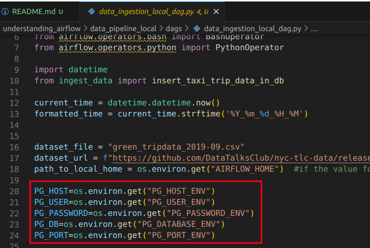
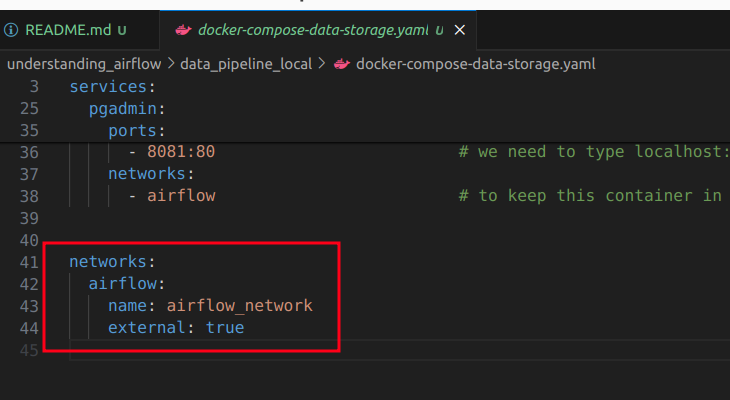

# Essential information to understand Airflow (Local ingestion)

### Managing environment variables
- Adding User variable : `echo -e "AIRFLOW_UID=$(id -u)" > .env`
- Adding database credentials to as environment variable

    

**Question**: How this environment variable will be read by dags of airflow?  
**Answer**: 
- These environment variables from local file will be extracted and set as airflow environment variable in docker-compose file 

- Environment variable of Airflow will be extracted in python script

    

### Creating external network to connect multiple containers
Here, 2 docker-composer file exists.
- `docker-compose-data-storage.yaml` file creates container for data storage and pgadmin to access the data
- `docker-compose.yaml` file creates containers related to airflow

To keep all these containers in the same network, 
- an custom network (*airflow_network*) was created in `docker-compose.yaml` file

    

- all the containers of this file were created using `docker-compose up -d` command which made the network available

- the custom network was added to `docker-compose-data-storage.yaml` file as external network 

    

- the network was ***also added to all services***

    

### Run docker commands
- Build the images
    - `docker compose build` or `docker-compose build`

- Create the containers of airflow
    - `docker compose up` or `docker-compose up`
    - `docker compose up -d` or `docker-compose up -d`    [detached mode]

- create containers related to data storage
    - `docker-compose -f <filename> up -d`
    - `docker compose -f docker-compose-data-storage.yaml up -d`

- Remove the containers
    - `docker compose -f docker-compose-data-storage.yaml down`      [These containers need to be stopped first]
    - `docker compose down` or `docker-compose down`
    

