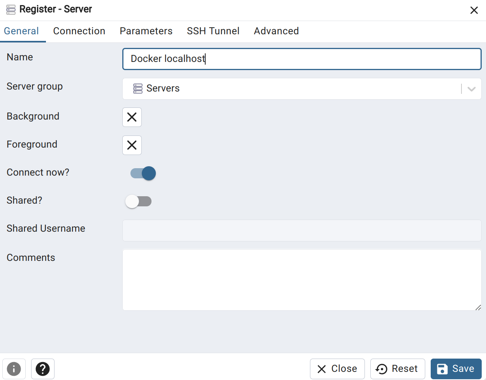
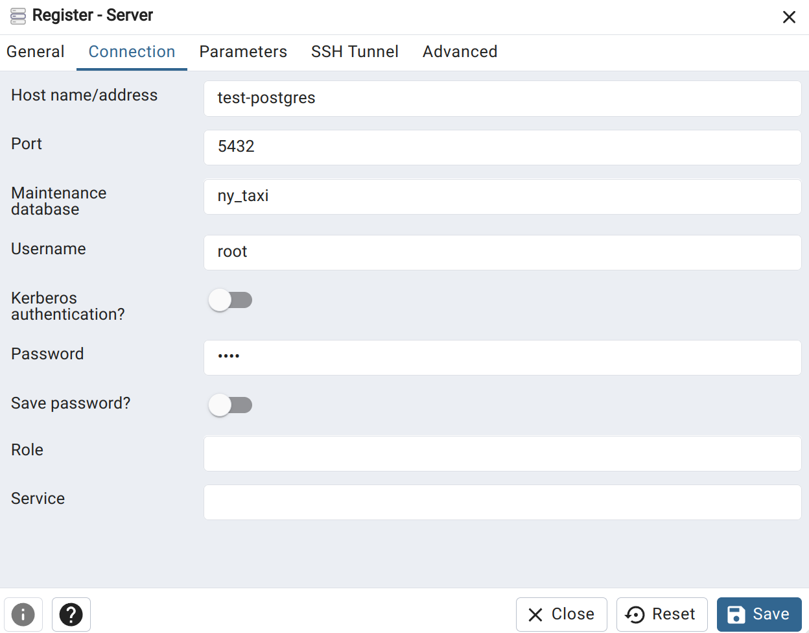
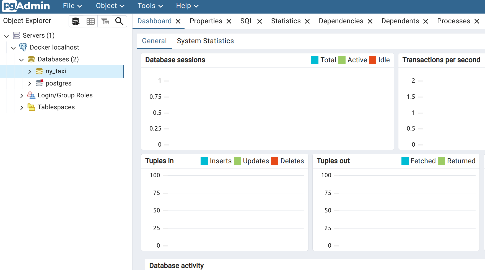

## Building image and creating a container
- Building image from docker file: `docker build ./understanding_docker/ -t test:pandas`


- Running container: `docker run -it test:pandas`
- Running container with argument: `docker run -it test:pandas 2024-01-01`


## Pulling image from Dockerhub and creating a container
### Postgres Image
- Pulling postgres image from Docker hub: `docker pull postgres:13`
- Running container with postgres:
    ```
    docker run -it --name some-postgres \
        -e POSTGRES_USER=root \
        -e POSTGRES_PASSWORD=root \
        -e POSTGRES_DB=ny_taxi \
        -v $(pwd)/ny_taxi_postgres_data:/var/lib/postgresql/data \
        -p 5432:5432 \
        -d postgres:13
    ```

- Install python library to intaract with database: `pip install pgcli`

### pgAdmin Image
- Pulling pgAdmin image from Docker hub: `docker pull dpage/pgadmin4`

- Running container with pgAdmin:
    ```
    docker run -it --name pgadmin_container \
    -e PGADMIN_DEFAULT_EMAIL="admin@admin.com" \
    -e PGADMIN_DEFAULT_PASSWORD="root" \
    -p 8080:80 \
    dpage/pgadmin4
    ```

    **Problem:**  
    When pgAdmin wants to connect to postgres database, it shows error as pgAdmin and postgres are not in same container.

    **Solution:**      
    Need to connect two different container with same network   


## Multiple container in same network 
- Creating a docker network: `docker network create pg-network`
- Creating postgres container on that network:
    ```
    docker run -it \
        -e POSTGRES_USER=root \
        -e POSTGRES_PASSWORD=root \
        -e POSTGRES_DB=ny_taxi \
        -v $(pwd)/ny_taxi_postgres_data:/var/lib/postgresql/data \
        -p 5432:5432 \
        --name test-postgres \
        --network=pg-network \
        -d postgres:13
    ```
    -d --> Detached mode

- Creating pgAdmin container on the same network:
    ```
    docker run -it \
    -e PGADMIN_DEFAULT_EMAIL="admin@admin.com" \
    -e PGADMIN_DEFAULT_PASSWORD="root" \
    -p 8080:80 \
    --name test-pgadmin \
    --network=pg-network \
    -d dpage/pgadmin4
    ```

- Connecting to postgres using pgAdmin:
    
    
    